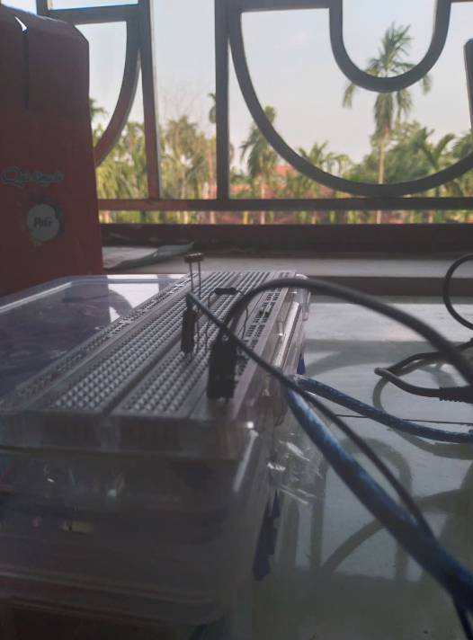
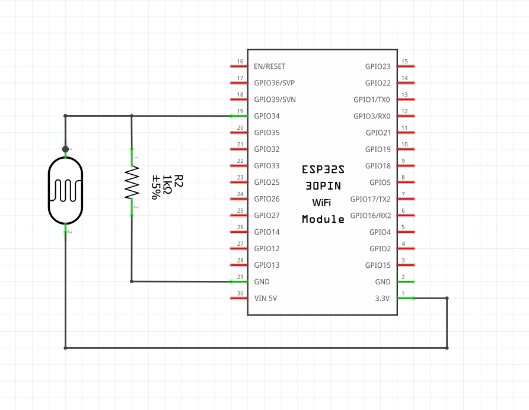
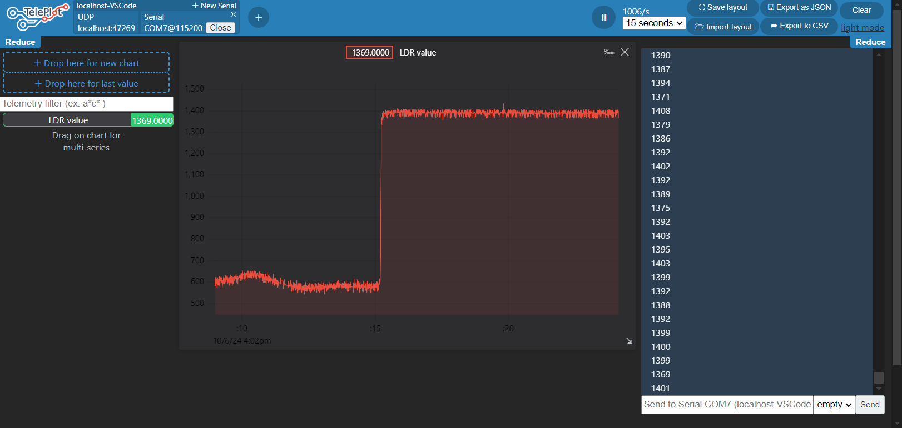

## LDR SENSOR WITH ESP32

Các chức năng đã làm trong dự án này:
- Đọc giá trị độ sáng (tương đối) từ quang trở qua chân ADC(A0) của ESP32
- In giá trị này ra cổng UART dạng số nguyên (0 - 4095)
- Sử dụng công cụ vẽ đồ thị để vẽ đồ thị đo cường độ sáng thu được theo thời gian thực

## Author
- Tu Van Hoai Nam

## Material
- 1 x ESP32
- 1 x LDR
- 1 x resistor 1K
- 1 x breadboard
- PlatformIO/VS code
- Teleplot/VS code
- Fritzing

## Connection

|  ESP32 Pin  |   Components   |  
|-------------|----------------|
| 3.3V        | Breadboard (+) |
| GND         | Breadboard (-) |
| A0          | LDR PIN        |

## Result

Sử dụng công cụ vẽ đồ thị Teleplot để vẽ đồ thị đo cường độ sáng từ cảm biến LDR theo thời gian thực 